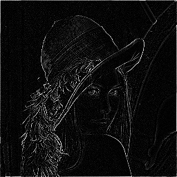

# Convolution-Edge-Detection
CUDA and OpenCV 4.0 based Laplacian Convolution implementation
using a 5-point stencil to detect edges in grayscale images.

# What does Laplacian Derivation do here?
**Under Construction**
- Explanation of Laplacian Derivation
- 5 point Stencil operation and how laplacian convolution is built off this idea
- Why 5 point stencil is crucial for edge detection
- Why Halo regions and shared memory are crucial for stencil ops

# Requirements
Laptop with Nvidia based GPU or google collab alernative (which I used)
since I have a Mac-Air which runs on the Apple silicon chip:

Google Colab virtual environment: Select T4 GPU as runtime type

# How to Compile
If using Colab which is what I recommend, first clone the git reposirotry
and cd into the project

``` bash
git clone https://github.com/ananthkrj/Convolution-Edge-Detection.git
cd Convolution-Edge-Detection 
```

Then compile using these gpu commands and manually setting to a specific gpu
version in -arch=sm_75, because the GPU hardware provided in a colab session
only supports computing that replicates Nvidia's Tesla T4:

```bash 
nvcc -arch=sm_75 -o laplacian LaplaceConv.cu `pkg-config --cflags --libs opencv4`
```

# How to run and save output?
Once the program is compiled, you can run using this command (don't forget to add a ! in front of compiling and running statements if using collab!):
```bash
./laplacian Lena.jpg
```
Once the Kernel and memory operations are compiled successfully (I incorported error checking to successfully print this, so you will receive this message in compilation), the edge detected image should be saved as
laplacian_result.jpg.

Save output on your local machine with these commands in colab:
```bash
from google.colab import files
files.download('laplacian_result.jpg')
```
# Before you run
- Make sure the Lena.jpg test image is properly loaded, include it when running program just in case. 
- Can test on any grayscale image, not just lena.jpg, just make sure to properly load main function within source code
- OpenCV version must be at least v4.
- Also make sure you are compiling with the proper nvcc version commands if using colab. Ignore if you have a PC with Nvidia GPU.


# Results and runtime
Test Image:


Output/Edge Detected Image:



What is going on Here:
- As disccused earlier, the Laplacian 5 point stencil operation computes whether or not a pixel is an edge value based on it's left, right, top, bottom neighbors. 
- In essence, it detects if the main tile pixel exhibits behavior of rapid change, which is labeled as an edge based on it's neighbors.

# Contact
For any general questions on the project contact:
ananthkrj@gmail.com

If you are curious about the CUDA and shared memory + Halo Region concepts that went into this project, would love it if you gave my Medium article a read!:

**Under Construction**

# License 
MIT License